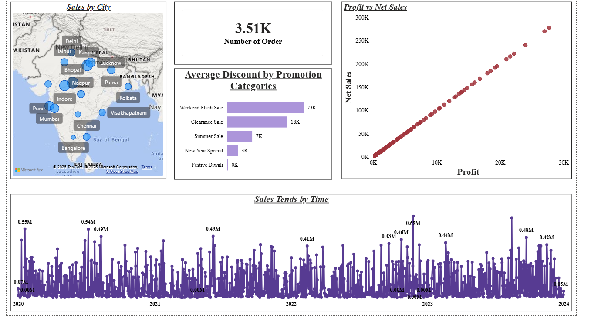

# 📊 Sales Data Analysis Dashboard – Power BI

An interactive **Sales Data Analysis Dashboard** developed using **Microsoft Power BI** to analyze sales performance, identify business trends, and generate meaningful insights from sales data.

The project demonstrates the complete data analytics workflow, including **data cleaning, transformation, data modeling, DAX calculations, and interactive dashboard development**.

---

## 📌 Project Overview

The objective of this project is to transform raw sales data into an interactive Power BI dashboard that helps analyze:

- Overall sales performance
- Sales and profit trends
- Product and category performance
- Regional performance
- Customer behavior
- Quantity sold
- Key business performance indicators

The dashboard allows users to interact with the data using filters and slicers to explore different aspects of sales performance.

---

## 🎯 Project Objectives

- Clean and prepare raw sales data for analysis
- Transform data using Power Query
- Build a suitable data model
- Create calculated measures using DAX
- Analyze sales and profit performance
- Identify top-performing products and categories
- Analyze sales trends over time
- Create an interactive and user-friendly dashboard
- Present business insights through data visualization

---

## 🗂️ Dataset

The project uses a sales dataset containing information related to customers, products, orders, sales, quantity, profit, and other business-related attributes.

The dataset was prepared and transformed before being used to create the Power BI dashboard.

### Major Data Categories

- Order information
- Customer information
- Product information
- Sales information
- Quantity
- Profit
- Date/Time information
- Category and sub-category information
- Geographic information

---

## 🔄 Data Analysis Workflow

```text
Raw Sales Data
      ↓
Data Cleaning
      ↓
Data Transformation
      ↓
Power Query
      ↓
Data Modeling
      ↓
DAX Measures
      ↓
Data Visualization
      ↓
Interactive Power BI Dashboard
      ↓
Business Insights
```

---

## 🧹 Data Cleaning & Transformation

Power Query was used to prepare the dataset for analysis.

The preprocessing stage included:

- Removing unnecessary columns
- Handling missing values
- Removing duplicate records
- Correcting data types
- Renaming columns where required
- Formatting date fields
- Creating required calculated fields
- Preparing data for analysis

---

## 🧩 Data Modeling

A structured data model was created in Power BI to establish relationships between the relevant tables and support efficient analysis.

The model helps connect:

- Sales data
- Customer data
- Product data
- Date information
- Category information

---

## 📐 DAX & Calculations

DAX (Data Analysis Expressions) was used to create business metrics and calculated measures.

Examples include:

- Total Sales
- Total Profit
- Total Quantity
- Average Sales
- Sales Growth
- Profit Margin
- Year-to-Date Sales
- Month-to-Date Sales

---

## 📊 Dashboard Features

The Power BI dashboard provides interactive analysis through:

### 🔹 KPI Cards

Key performance indicators such as:

- Total Sales
- Total Profit
- Total Quantity
- Number of Orders

### 🔹 Sales Trend Analysis

Visualizes sales performance over time using charts to identify trends and changes.

### 🔹 Product Analysis

Analyzes product performance and helps identify high-performing and low-performing products.

### 🔹 Category Analysis

Compares sales and profit across different product categories and sub-categories.

### 🔹 Regional Analysis

Provides insights into sales performance across different geographical regions.

### 🔹 Interactive Filters

Users can dynamically filter the dashboard based on:

- Date
- Category
- Product
- Region
- Customer
- Other available dimensions

---

## 💡 Key Insights

The dashboard can be used to identify:

- Products contributing significantly to total sales
- Categories generating higher revenue
- Regions with stronger sales performance
- Changes in sales over time
- Relationship between sales and profit
- Products or categories requiring further attention
- Overall business performance

> **Note:** Specific numerical insights should be added here after analyzing the final dashboard. This makes the README more credible and demonstrates your actual findings.

---

## 📸 Dashboard Preview

### 🏠 Dashboard Overview



---

## 🛠️ Tools & Technologies

| Tool | Purpose |
|---|---|
| **Microsoft Power BI** | Dashboard development & visualization |
| **Power Query** | Data cleaning & transformation |
| **DAX** | Measures and business calculations |
| **Microsoft Excel** | Data source / data preparation |
| **GitHub** | Project version control & documentation |

---


## ▶️ How to Use

### 1. Clone the repository

```bash
git clone https://github.com/KashishCh02/Sales-data-Analysis-Power-Bi-.git
```

### 2. Open the project

Download the `.pbix` Power BI file from the repository.

### 3. Open with Power BI Desktop

Open the `.pbix` file using **Microsoft Power BI Desktop**.

### 4. Explore the Dashboard

Use the available:

- Slicers
- Filters
- Charts
- KPI cards
- Tables
- Interactive visuals

to explore the sales data.

---

## 📚 What I Learned

Through this project, I gained practical experience in:

- Data cleaning and transformation
- Power Query
- Data modeling
- DAX
- KPI creation
- Interactive dashboard design
- Data visualization
- Business-oriented data analysis
- Presenting insights from raw data

---

## 🔮 Future Improvements

- Add more advanced DAX measures
- Add forecasting capabilities
- Add customer segmentation
- Add more interactive dashboard pages
- Add automated data refresh
- Improve dashboard UI/UX
- Add advanced business intelligence features


---

⭐ If you find this project useful, feel free to explore the repository and provide feedback.
